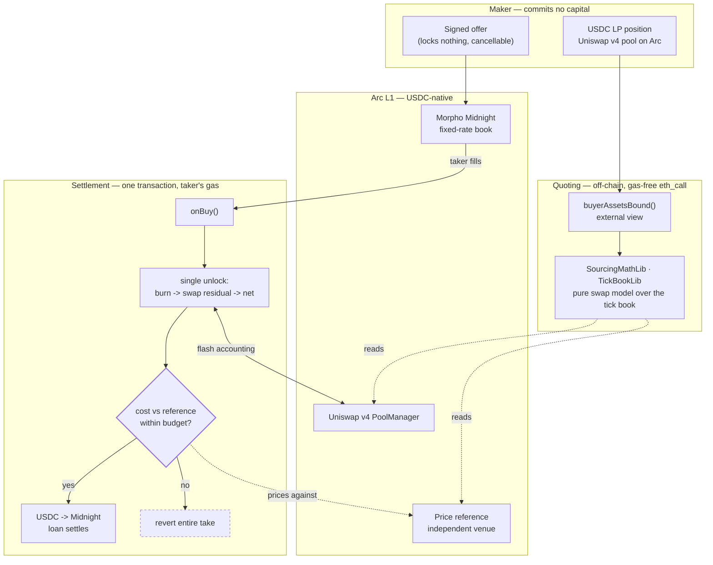

# doubleQuote on Arc

**Submission note for the Circle Arc track.** This file states plainly what is deployed, what is
not, and why — including the parts that are not finished.

---

## Why this project is stablecoin-native

doubleQuote exists to solve a problem that only exists because stablecoins made idle capital
expensive.

A Midnight maker who wants to quote a fixed-rate USDC loan has to commit the USDC *now*, to a book
that may not fill for days. Meanwhile the same USDC would earn fees in a Uniswap stable pool. Today
the maker picks one. doubleQuote lets the capital sit in the Uniswap position and quote the loan at
the same time, unwinding **only** the amount a taker actually fills, at the instant they fill it.

That is a multi-step conditional settlement — burn liquidity, sell the residual, price the result
against an independent reference, deliver the loan, revert the whole thing if the price was wrong —
executed atomically in one transaction, on the taker's gas, with no off-chain solver in the loop and
no privileged keeper. It is exactly the class of programmable money flow Arc is built for, and it is
denominated in USDC end to end.

Arc sharpens it further: **USDC is the gas token**, so the maker's collateral, the loan asset, the
LP position's quote asset and the transaction fee are all the same unit. The cost guard and the fee
are finally denominated in the same thing.

---

## Architecture

The three venues — **park**, **route**, **reference** — are chosen independently. Parking is
permissionless; routing and referencing are immutable at deploy and unreachable from offer data.
That separation is the entire safety argument, and it is unchanged on Arc.

---

## Status — what is actually deployed

**Honest summary: the working demo is on Base. Arc mainnet deployment is scheduled, not done.**

The reason is a calendar collision, not a technical one:

| | |
|---|---|
| Hackathon submission deadline | **13 Sep 2026** |
| Arc public mainnet opens | **16 Sep 2026** |

Arc mainnet (chain `5042`) does not exist yet at submission time. Arc **testnet** (`5042002`) does,
and is live — but it carries no Uniswap and no Morpho, so there is nothing to park in and no book to
quote to.

Probed directly against `https://rpc.testnet.arc.network` on 11 Sep 2026 (`eth_getCode`):

| Contract | Arc testnet `5042002` |
|---|---|
| USDC `0x3600…0000` | ✅ deployed |
| Permit2 `0x0000…8BA3` | ✅ deployed |
| Multicall3 `0xcA11…CA11` | ✅ deployed |
| Uniswap v4 `PoolManager` | ❌ no code |
| Uniswap v3 | ❌ no code |
| Morpho / Midnight | ❌ no code |

So the demo lives on **Base**, where Midnight, Uniswap v3 and Uniswap v4 are all deployed and the
full 207-test suite runs against real forked state. See [`DEMO.md`](./DEMO.md).

---

## Arc mainnet deployment plan

Uniswap has announced v4 on Arc mainnet at `0x8366a39cc670b4001a1121b8f6a443a643e40951`, and Circle
names Morpho among the day-one protocols. Both are prerequisites, and both land on 16 Sep.

The port is a redeploy, not a rewrite — the adapters take their venues as constructor immutables and
bind everything through interfaces:

1. **Point the factory at Arc's `PoolManager`.** `UniswapV4BuyCallbackFactory` takes the pool
   manager and Midnight addresses as constructor arguments; nothing is hard-coded.
2. **Choose a reference venue.** This is the one real decision. The production reference reads a v3
   TWAP via `observe()` ([`FEEDBACK.md` §B6](./FEEDBACK.md) explains why v4 cannot supply one), so
   Arc needs either a v3 deployment or a v4 oracle hook. If neither exists at launch, the reference
   becomes the fallback documented in `JOURNAL.md` and the slippage budget widens accordingly — the
   tick-quantisation floor in [`FEEDBACK.md` §B1](./FEEDBACK.md) sets the lower bound.
3. **Re-run the suite against forked Arc.** The test base takes an RPC and a block; pointing
   `ForkBase` at Arc is a constant change.
4. **Deploy and verify**, recording addresses in this file.

Target: **before 30 Sep 2026.**

### Deployed addresses

| Network | Chain | Contract | Address |
|---|---|---|---|
| Base | 8453 | see [`DEMO.md`](./DEMO.md) | — |
| Arc mainnet | 5042 | — | *pending mainnet launch* |

---

## What is not done

Stated explicitly rather than left for a judge to discover:

- **No Arc deployment yet.** Arc mainnet opens three days after the submission deadline.
- **The reference-venue question on Arc is open** (step 2 above) and depends on what ships at
  launch.
- **No Circle Agent Stack / Nanopayments / Paymaster integration.** This submission targets the
  DeFi/onchain-finance bounty, not the agentic one. Claiming otherwise would be dressing.
