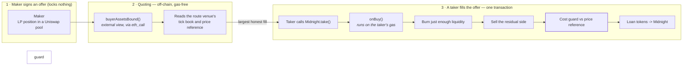

# doubleQuote

**The same USDC quotes in two order books at once. Whichever fires first atomically unwinds the
other.**

A [Morpho Midnight](https://github.com/morpho-org/midnight) maker **buy-callback** that parks a
lender's capital in a **Uniswap LP position** instead of leaving it idle in a lending market, and
unwinds exactly as much of it as is needed, just-in-time, when a fixed-rate offer is taken.

Today a Midnight maker's capital is committed the moment they want to quote. doubleQuote removes
that: the maker signs an offer that locks nothing, keeps earning Uniswap LP fees while it sits in
the book, and only gives up liquidity at the instant a loan is actually filled — for exactly the
size filled.

> ETHGlobal hackathon submission. Submitted to the **Uniswap Foundation** track (see
> [`FEEDBACK.md`](./FEEDBACK.md)) and the **Circle Arc** track (see [Arc](#arc) below).

---

## How it works



Three venues are chosen **independently**, and keeping them independent is the design:

| | what it is | who may choose it |
|---|---|---|
| **Park** | where the maker's LP position sits | permissionless — any pool |
| **Route** | where the residual side is sold at settlement | fixed at deploy, immutable |
| **Reference** | where the honest price is read to police the route | fixed at deploy, immutable |

The safety envelope (`IPriceRef`, the slippage budget, the route venue, `OWNER`, `MIDNIGHT`) is
**immutable and unreachable from `callbackData`**. The maker signs an offer once; nothing at
execution time can hand the callback a fresh route, a fresh `minOut` or a fresh price. Every
execution-time decision derives from on-chain state.

---

## Where the Uniswap integration lives

Every claim below points at the line that backs it.

### Quoting — a swap priced from inside a `view`

Midnight's routing layer calls `buyerAssetsBound` off-chain on every maker in the book, so it must
be `external view`. That rules out every official Uniswap quoter, all of which simulate-and-revert
(see [`FEEDBACK.md` §A1](./FEEDBACK.md)). The swap loop is therefore reimplemented as pure math.

| What | File | Line |
|---|---|---|
| The quoting entry point | [`UniswapBuyCallbackBase.sol`](./src/UniswapBuyCallbackBase.sol#L126) | `buyerAssetsBound` · L126 |
| Bisection for the largest honest fill | [`SourcingMathLib.sol`](./src/libraries/SourcingMathLib.sol#L480) | `boundBySlippage` · L480 |
| Multi-tick swap model (`pure`) | [`SourcingMathLib.sol`](./src/libraries/SourcingMathLib.sol#L338) | `multiStepOut` · L338 |
| Non-monotonicity cap, `dL ≤ 0.5·L` | [`SourcingMathLib.sol`](./src/libraries/SourcingMathLib.sol#L86) | `MAX_ACTIVE_SHARE_WAD` · L86 |
| `LiquidityAmounts` composed by hand | [`SourcingMathLib.sol`](./src/libraries/SourcingMathLib.sol#L95) | `amountsForLiquidity` · L95 |
| Tick-book walk, venue-agnostic | [`TickBookLib.sol`](./src/libraries/TickBookLib.sol#L55) | `readBook` · L55 |
| Bitmap search re-derived by value | [`TickBookLib.sol`](./src/libraries/TickBookLib.sol#L94) | `_nextTick` · L94 |

### Uniswap v3 — park, burn, route

| What | File | Line |
|---|---|---|
| Park venue spot price | [`UniswapV3BuyCallback.sol`](./src/UniswapV3BuyCallback.sol#L177) | `IUniswapV3Pool.slot0()` · L177 |
| Burn just enough liquidity | [`UniswapV3BuyCallback.sol`](./src/UniswapV3BuyCallback.sol#L195) | `decreaseLiquidity` · L195 |
| Collect the burned amounts | [`UniswapV3BuyCallback.sol`](./src/UniswapV3BuyCallback.sol#L203) | `collect` · L203 |
| Sell the residual on the route venue | [`UniswapV3BuyCallback.sol`](./src/UniswapV3BuyCallback.sol#L247) | `IUniswapV3Pool.swap` · L247 |
| Read the position | [`UniswapV3BuyCallback.sol`](./src/UniswapV3BuyCallback.sol#L344) | `NPM.positions` · L344 |
| Route venue tick bitmap | [`UniswapV3BuyCallback.sol`](./src/UniswapV3BuyCallback.sol#L350) | `tickBitmap` · L350 |
| Route venue `liquidityNet` | [`UniswapV3BuyCallback.sol`](./src/UniswapV3BuyCallback.sol#L354) | `ticks` · L354 |

### Uniswap v4 — the whole unwind inside one `unlock`

The v4 adapter is the reason v4 is worth having: burn, residual swap and settlement all net against
each other inside a **single** `unlock`, with one token movement at the end.

| What | File | Line |
|---|---|---|
| One unlock does the entire settlement | [`UniswapV4BuyCallback.sol`](./src/UniswapV4BuyCallback.sol#L105) | `unlock(Action.SettleFill)` · L105 |
| Burn inside the unlock | [`UniswapV4BuyCallback.sol`](./src/UniswapV4BuyCallback.sol#L196) | `modifyLiquidity` · L196 |
| Residual swap against the delta | [`UniswapV4BuyCallbackBase.sol`](./src/UniswapV4BuyCallbackBase.sol#L108) | `_swapResidual` · L108 |
| The single token movement | [`UniswapV4BuyCallback.sol`](./src/UniswapV4BuyCallback.sol#L157) | `PoolManager.take` · L157 |
| `sync` → transfer → `settle` | [`UniswapV4BuyCallback.sol`](./src/UniswapV4BuyCallback.sol#L211) | `_settleOwed` · L211 |
| Pool state via `StateLibrary` | [`UniswapV4BuyCallbackBase.sol`](./src/UniswapV4BuyCallbackBase.sol#L237) | `getTickBitmap` · L237 |
| | [`UniswapV4BuyCallbackBase.sol`](./src/UniswapV4BuyCallbackBase.sol#L241) | `getTickLiquidity` · L241 |
| NFT-custody variant (two unlocks) | [`UniswapV4NftBuyCallback.sol`](./src/UniswapV4NftBuyCallback.sol#L161) | `unlock` · L161 |

### Price reference — v3 `observe()`

v4 has no in-protocol price history and the reference oracle hook is no longer in `v4-periphery`
([`FEEDBACK.md` §B6](./FEEDBACK.md)), so the production reference reads v3 — **even for the v4
adapters**.

| What | File | Line |
|---|---|---|
| TWAP over `observe()` | [`V3TwapRef.sol`](./src/price-refs/V3TwapRef.sol#L91) | `meanTick` · L91 |
| Round-down fix for negative ticks | [`V3TwapRef.sol`](./src/price-refs/V3TwapRef.sol#L100) | L100 |
| Fail at deploy, not at settlement | [`V3TwapRef.sol`](./src/price-refs/V3TwapRef.sol#L44) | `InsufficientObservationHistory` · L44 |

### The safety guard

A maker who routes into a pool an attacker has moved would settle at the attacker's price. The
guard prices the settlement against the reference and reverts the whole take if it exceeds budget.

| What | File | Line |
|---|---|---|
| Realised cost vs budget | [`SourcingMathLib.sol`](./src/libraries/SourcingMathLib.sol#L652) | `costWad` · L652 |
| Enforced in v4 | [`UniswapV4BuyCallback.sol`](./src/UniswapV4BuyCallback.sol#L152) | L152 |

---

## Verifying it

The whole suite **forks Base at a pinned block** and binds the already-deployed Midnight, Uniswap v3
and Uniswap v4 contracts through interfaces — so these are not mocks.

```shell
cp .env.example .env   # optional: set BASE_RPC_URL for a private endpoint
forge build
forge test
```

**207 tests**, all against forked Base. The ones worth reading first:

| Suite | What it proves |
|---|---|
| [`SandwichV3.t.sol`](./test/SandwichV3.t.sol) · [`SandwichV4.t.sol`](./test/SandwichV4.t.sol) | The attack is real, and the guard stops it. An unguarded twin burns exactly 2× the honest liquidity. |
| [`DustGriefV3.t.sol`](./test/DustGriefV3.t.sol) | Splitting a fill into 200 takes bleeds 0.7% more than one take — griefing is uneconomic by ~3 orders of magnitude. |
| [`MidnightIntegration.t.sol`](./test/MidnightIntegration.t.sol) | A real `take()` against deployed Midnight settles end to end. |
| [`SourcingMathLib.t.sol`](./test/SourcingMathLib.t.sol) | 54 tests on the bound math, including the non-monotonicity cap. |
| [`DemoPreflight.t.sol`](./test/DemoPreflight.t.sol) | The live-market demo, dry-run against the real Dec-2026 market. |

CI additionally enforces `forge fmt --check`, `forge build --sizes`, and
[`script/check-licenses.py`](./script/check-licenses.py), which asserts the BUSL-1.1 surface reaching
the build stays **enumerated and unchanged** (see [`FEEDBACK.md` §E2](./FEEDBACK.md)).

---

## Demo

[`DEMO.md`](./DEMO.md) walks the live Base demo end to end: park real capital in a Uniswap position,
quote it into Midnight's book, fill the offer, and watch the LP position unwind into a Morpho
lending position — visible in the Uniswap and Morpho frontends throughout.

---

## Arc

Circle's **Arc** mainnet (chain `5042`) opens 16 Sep 2026 with Uniswap v4 and Morpho both live at
launch. doubleQuote is stablecoin-native by construction — it exists to make idle USDC quote in two
markets at once — and the adapters are venue-agnostic by design, so the Arc deployment is a
redeploy against Arc's `PoolManager`, not a port.

Arc **testnet** (`5042002`) today carries USDC, Permit2 and Multicall3 but no Uniswap and no Morpho,
so the callback has nothing to park in or quote to there. See [`ARC.md`](./ARC.md) for the
deployment plan and current status.

---

## Docs

| File | What's in it |
|---|---|
| [`FEEDBACK.md`](./FEEDBACK.md) | **Uniswap developer feedback** — 19 findings, each with a file, a line and a time cost |
| [`FRICTION.log`](./FRICTION.log) | The raw log `FEEDBACK.md` is edited from, written in the moment |
| [`JOURNAL.md`](./JOURNAL.md) | Architectural decisions and the reasoning behind them |
| [`DEMO.md`](./DEMO.md) | Live demo runbook |
| [`PLAN.md`](./PLAN.md) | Day-by-day schedule and ranked risks |

## Layout

```
src/
  UniswapBuyCallbackBase.sol      shared callback + quoting entry point
  UniswapV3BuyCallback.sol        v3 adapter (NFT custody stays with the maker)
  UniswapV4BuyCallback.sol        v4 adapter, custodial — one unlock
  UniswapV4NftBuyCallback.sol     v4 adapter, NFT custody — two unlocks
  libraries/    SourcingMathLib (bound math), TickBookLib (venue-agnostic book walk)
  price-refs/   V3TwapRef
  interfaces/
test/           207 fork tests against Base
script/         Demo.s.sol, check-licenses.py
```

## Licence

GPL-2.0-or-later. Midnight's buy-callback periphery is GPL-2.0-or-later and may be forked; Midnight
*core* and Uniswap v4's `PoolManager` are BUSL-1.1 and are bound through interfaces, never vendored.
